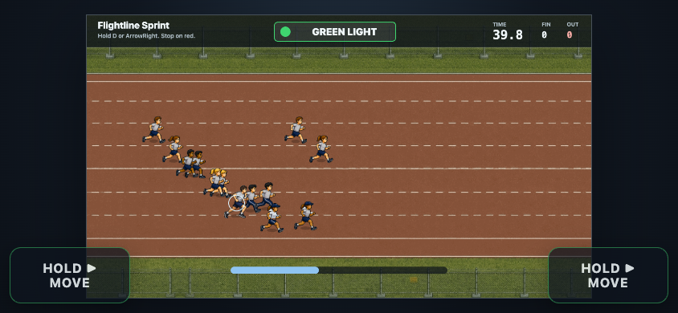

# Red Light / Green Light: Flightline Sprint

A playable single-file, offline Canvas 2D Red Light / Green Light game with fictionalized, stylized, USAF-inspired training-field visuals.

Play it directly at https://vibezzzcoder.github.io/flightline-sprint/

## Screenshot

## Features

- Long horizontally scrolling race with camera-follow gameplay
- Green, warning, and red phases synchronized to an accelerating chant
- Twelve independently reacting NPC runners
- Keyboard and mobile touch controls
- Win, caught-moving, timeout, pause, restart, mute, and debug states
- Embedded visuals and audio with no external runtime requests

## How To Play Locally

Open `flightline-sprint.html` directly in a browser. No install, build step, local server, CDN, package manager, or external runtime dependency is required.

## Keyboard Controls

- `Space` or `Enter`: start or restart
- `D` or `ArrowRight`: sprint right
- `P`: pause or resume
- `M`: toggle sound
- `F1` or `` ` ``: toggle debug overlay

## Touch Controls

- Tap `Start` or `Restart` when shown.
- Hold either bottom-corner `Hold ▶ Move` button to sprint.
- Release before red light.

## Status

Playable prototype/MVP. The exact source and release artifact is `flightline-sprint.html`.

## License

This project is licensed under the GNU General Public License v3.0 or later.

Copyright (C) 2026 VibezZzCoder

This program is free software: you can redistribute it and/or modify it under the terms of the GNU General Public License as published by the Free Software Foundation, either version 3 of the License, or (at your option) any later version.

This program is distributed in the hope that it will be useful, but WITHOUT ANY WARRANTY; without even the implied warranty of MERCHANTABILITY or FITNESS FOR A PARTICULAR PURPOSE. See the GNU General Public License for more details.

See `LICENSE` for the full license text.

## Unofficial Prototype Disclaimer

This is an independent fan/prototype project. It is not an official U.S. Air Force product. It is not endorsed by, sponsored by, or affiliated with the U.S. Air Force, the Department of the Air Force, or the U.S. Department of Defense.

The project uses fictionalized, stylized, military-inspired characters/settings. No official endorsement is implied.

## Trademarks And Official Marks

The GPL applies to this project's original code and original assets. It does not grant rights to use third-party trademarks, logos, seals, emblems, official marks, official insignia, or protected identifiers.

Do not imply ownership of or affiliation with the U.S. Air Force, Department of the Air Force, or Department of Defense.

## Korean Voiceover Credits

Green light red light by Sandermotions -- https://freesound.org/s/592876/ -- License: Creative Commons 0
